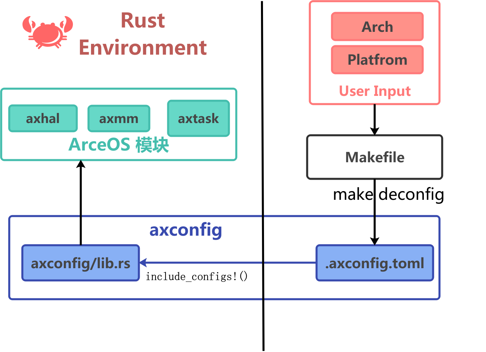

# ArceOS 配置与构建系统

ArceOS 的配置系统主要分为两条主线：

1. **模块配置系统**：通过在 `Cargo.toml` 中配置模块依赖来实现，决定了哪些模块会被编译和包含在最终的系统中。
2. **平台配置系统**：通过 `axconfig` 工具来管理和生成平台配置，决定了内核的运行平台、内存布局和设备驱动等。

## 模块配置系统

模块配置通过在 `Cargo.toml` 文件中指定依赖来实现，ArceOS 中的每个模块都有自己的配置选项，但是通常情况下，模块与模块之间存在着依赖关系，例如文件系统模块 `axfs` 依赖于设备驱动模块 `axdriver` 的 `virtio-blk` 作为块设备。

那么就会导致，如果用户需要使用文件系统模块，那么就必须同时启用设备驱动模块的 `virtio-blk` 功能。

显然，这样的依赖关系会导致用户需要了解每个模块的依赖关系才能正确地配置内核应用。

因此 ArceOS 提供了 `axfeat` 这样一个 Feature 配置模块来管理模块之间的依赖关系，核心思想在于：**将用户的视角从配置模块转向了配置需要使用的功能**。

`axfeat` 内部没有任何的 rust 代码，主要使用 `Cargo.toml` 中的 `features` 字段来定义模块之间的依赖关系：

```toml
[features]
default = []

# Multicore
smp = ["axhal/smp", "axruntime/smp", "axtask?/smp", "kspin/smp"]

# Floating point/SIMD
fp_simd = ["axhal/fp_simd"]

# Interrupts
irq = ["axhal/irq", "axruntime/irq", "axtask?/irq"]

# Memory
alloc = ["axalloc", "axruntime/alloc"]
alloc-tlsf = ["axalloc/tlsf"]
alloc-slab = ["axalloc/slab"]
alloc-buddy = ["axalloc/buddy"]
page-alloc-64g = ["axalloc/page-alloc-64g"] # up to 64G memory capacity
page-alloc-4g = ["axalloc/page-alloc-4g"] # up to 4G memory capacity
paging = ["alloc", "axhal/paging", "axruntime/paging"]
tls = ["alloc", "axhal/tls", "axruntime/tls", "axtask?/tls"]
dma = ["alloc", "paging"]

# Multi-threading and scheduler
multitask = ["alloc", "axtask/multitask", "axsync/multitask", "axruntime/multitask"]
sched_fifo = ["axtask/sched_fifo"]
sched_rr = ["axtask/sched_rr", "irq"]
sched_cfs = ["axtask/sched_cfs", "irq"]

# File system
fs = ["alloc", "paging", "axdriver/virtio-blk", "dep:axfs", "axruntime/fs"] # TODO: try to remove "paging"
myfs = ["axfs?/myfs"]
lwext4_rs = ["axfs/lwext4_rs"]

# Networking
net = ["alloc", "paging", "axdriver/virtio-net", "dep:axnet", "axruntime/net"]

# Display
display = ["alloc", "paging", "axdriver/virtio-gpu", "dep:axdisplay", "axruntime/display"]

# Real Time Clock (RTC) Driver.
rtc = ["axhal/rtc", "axruntime/rtc"]

# Device drivers
bus-mmio = ["axdriver?/bus-mmio"]
bus-pci = ["axdriver?/bus-pci"]
driver-ramdisk = ["axdriver?/ramdisk", "axfs?/use-ramdisk"]
driver-ixgbe = ["axdriver?/ixgbe"]
driver-fxmac = ["axdriver?/fxmac"] # fxmac ethernet driver for PhytiumPi
driver-bcm2835-sdhci = ["axdriver?/bcm2835-sdhci"]

# Logging
log-level-off = ["axlog/log-level-off"]
log-level-error = ["axlog/log-level-error"]
log-level-warn = ["axlog/log-level-warn"]
log-level-info = ["axlog/log-level-info"]
log-level-debug = ["axlog/log-level-debug"]
log-level-trace = ["axlog/log-level-trace"]
```

以上的 Feature 配置可以划分成以下七个部分：

1. **CPU**：
    - `smp`: 启用对称多处理（SMP）支持
    - `fp_simd`: 启用浮点和单指令多数据（SIMD）支持

2. **中断**：
    - `irq`: 启用中断处理支持

3. **内存**：
    - `alloc`: 启用动态内存分配
        - `alloc-tlsf`: 使用 TLSF 分配器
        - `alloc-slab`: 使用 slab 分配器
        - `alloc-buddy`: 使用伙伴系统分配器
    - `paging`: 启用页表操作
    - `tls`: 启用线程本地存储（thread-local）

4. **任务管理**：
    - `multitask`: 启用多线程支持
        - `sched_fifo`: 使用先入先出（FIFO）协作调度器
        - `sched_rr`: 使用轮询（Round-robin）抢占式调度器
        - `sched_cfs`: 使用完全公平调度器（CFS）抢占式调度器

5. **上层协议栈**：
    - `fs`: 启用文件系统支持
        - `myfs`: 允许用户定义自定义文件系统以覆盖默认设置
    - `net`: 启用网络支持
    - `display`: 启用图形支持

6. **设备驱动**：
    - `bus-mmio`: 使用设备树探测所有内存映射 I/O（MMIO）设备
    - `bus-pci`: 使用 PCI 总线探测所有 PCI 设备
    - `driver-ramdisk`: 使用 RAM 磁盘模拟块设备
    - `driver-ixgbe`: 启用英特尔 82599 10Gbit 网卡驱动
    - `driver-bcm2835-sdhci`: 启用 BCM2835 SDHCI 驱动（树莓派 SD 卡）

7. **日志系统**
    - `log-level-off`: 禁用所有日志记录
    - `log-level-error`：仅保留 error 级别及以上的日志记录
    - `log-level-warn`：仅保留 warn 级别及以上的日志记录
    - `log-level-info`：仅保留 info 级别及以上的日志记录
    - `log-level-debug`：仅保留 debug 级别及以上的日志记录
    - `log-level-trace`: 仅保留 trace 级别及以上的日志记录

## 平台配置系统

ArceOS 支持多种硬件平台，不同平台有着不同的启动流程、处理器状态以及平台相关设备，因此需要一个统一的配置系统来管理这些差异。基于这样的需求，ArceOS 的平台配置系统的目标如下：

1. 配置文件应易于理解和修改，支持用户自定义（**特定平台配置文件**）
2. 配置信息要在编译期确定，以便在内核启动时能够正确地识别和使用（**axconfig 模块**）
3. 用户可以通过指定 Arch 和 Platform 来选择编译目标平台，并且灵活配置（**Makefile**）



从全局的视角上看 ArceOS 为我们构建了如上的配置系统：

右半部分是**内核编译前**阶段，用户通过指定 `Arch` 和 `Platform` 来运行 `make deconfig`，这会将**特定平台配置文件**复制到 `.axconfig.toml` 中，为接下来的编译提供基础。

左半部分是**内核编译后**阶段，通过 `axconfig` 模块将 `.axconfig` 配置文件转换为静态的 rust 文件，由此配置信息可以进入内核环境以提供给 ArceOS 中的其他模块进行读取。

### 特定平台配置文件

ArceOS 的平台配置文件位于 `configs/platforms` 目录下，每个平台都有一个对应的配置文件，这些配置中包含：

- `arch`：架构标识符，如 `x86_64`、`riscv64` 等
- `platform`：平台标识符，如 `x86-pc`、`riscv64-qemu-virt` 等
- `plat`：平台特定配置，如内核地址空间、物理内存大小等
- `devices`：设备相关配置，如 MMIO 区域、VirtIO 设备等

如果需要添加新的平台配置，可以在该目录下创建一个新的 TOML 文件，文件名通常以 `<arch>-<platform>.toml` 的格式命名。

下面以 `riscv64-qemu-virt.toml` 作为具体的例子，对配置文件的内容进行说明：

```toml
# Architecture identifier.
arch = "riscv64"                    # str
# Platform identifier.
platform = "riscv64-qemu-virt"      # str

#
# Platform configs
#
[plat]
# Platform family.
family = "riscv64-qemu-virt"        # str

# Base address of the whole physical memory.
phys-memory-base = 0x8000_0000      # uint
# Size of the whole physical memory. (128M)
phys-memory-size = 0x800_0000       # uint
# Base physical address of the kernel image.
kernel-base-paddr = 0x8020_0000     # uint
# Base virtual address of the kernel image.
kernel-base-vaddr = "0xffff_ffc0_8020_0000"     # uint
# Linear mapping offset, for quick conversions between physical and virtual
# addresses.
phys-virt-offset = "0xffff_ffc0_0000_0000"      # uint
# Offset of bus address and phys address. some boards, the bus address is
# different from the physical address.
phys-bus-offset = 0                             # uint
# Kernel address space base.
kernel-aspace-base = "0xffff_ffc0_0000_0000"    # uint
# Kernel address space size.
kernel-aspace-size = "0x0000_003f_ffff_f000"    # uint

#
# Device specifications
#
[devices]
# MMIO regions with format (`base_paddr`, `size`).
mmio-regions = [
    [0x0010_1000, 0x1000],          # RTC
    [0x0c00_0000, 0x21_0000],       # PLIC
    [0x1000_0000, 0x1000],          # UART
    [0x1000_1000, 0x8000],          # VirtIO
    [0x3000_0000, 0x1000_0000],     # PCI config space
    [0x4000_0000, 0x4000_0000],     # PCI memory ranges (ranges 1: 32-bit MMIO space)
]                                   # [(uint, uint)]
# VirtIO MMIO regions with format (`base_paddr`, `size`).
virtio-mmio-regions = [
    [0x1000_1000, 0x1000],
    [0x1000_2000, 0x1000],
    [0x1000_3000, 0x1000],
    [0x1000_4000, 0x1000],
    [0x1000_5000, 0x1000],
    [0x1000_6000, 0x1000],
    [0x1000_7000, 0x1000],
    [0x1000_8000, 0x1000],
] # [(uint, uint)]
# Base physical address of the PCIe ECAM space.
pci-ecam-base = 0x3000_0000 # uint
# End PCI bus number (`bus-range` property in device tree).
pci-bus-end = 0xff # uint
# PCI device memory ranges (`ranges` property in device tree).
pci-ranges = [
    [0x0300_0000, 0x1_0000],        # PIO space
    [0x4000_0000, 0x4000_0000],     # 32-bit MMIO space
    [0x4_0000_0000, 0x4_0000_0000], # 64-bit MMIO space
]                                   # [(uint, uint)]

# Timer interrupt frequency in Hz.
timer-frequency = 10_000_000        # uint

# rtc@101000 {
#     interrupts = <0x0b>;
#     interrupt-parent = <0x03>;
#     reg = <0x00 0x101000 0x00 0x1000>;
#     compatible = "google,goldfish-rtc";
# };
# RTC (goldfish) Address
rtc-paddr = 0x10_1000               # uint
```

当然，以上是 `riscv64-qemu-virt` 平台下的默认配置，如果开发者有额外的需要，可以直接对内部的配置进行修改。

例如，在较为复杂的情形下，默认的 `phys-memory-size` 仅 128MB，无法满足需求，那么开发者可以将其扩大为 `0x1000_0000`（256MB）以适应更大的内存需求。

下面是对该配置文件进一步的说明：

| 配置项 | 描述 |
| --- | --- |
| **架构信息** | |
| arch | 架构标识符，为 `riscv64` |
| platform | 平台标识符，为 `riscv64-qemu-virt` |
| **平台配置** | |
| family | 平台标识符，为 `riscv64-qemu-virt` |
| phys-memory-base | 物理内存的基地址，为 `0x8000_0000` |
| phys-memory-size | 物理内存的大小，为 `0x800_0000`（128MB） |
| kernel-base-paddr | kernel 的物理基地址，为 `0x8020_0000` |
| kernel-base-vaddr | kernel 的虚拟基地址，为 `0xffff_ffc0_8020_0000` |
| phys-virt-offset | 物理地址与虚拟地址的转换偏移量，为 `0xffff_ffc0_0000_0000` |
| phys-bus-offset | 物理地址与总线地址的偏移量，为 `0` |
| kernel-aspace-base | 内核地址空间的基地址，为 `0xffff_ffc0_0000_0000` |
| kernel-aspace-size | 内核地址空间的大小，为 `0x0000_003f_ffff_f000` |
| **设备配置** | |
| mmio-regions | MMIO 区域列表，格式为 `[基地址, 大小]`，包括： |
| &nbsp;&nbsp;&nbsp;&nbsp;RTC | 实时时钟，用于提供时间信息 `[0x0010_1000, 0x1000]` |
| &nbsp;&nbsp;&nbsp;&nbsp;PLIC | 平台级中断控制器 `[0x0c00_0000, 0x21_0000]` |
| &nbsp;&nbsp;&nbsp;&nbsp;UART | 串行通信 `[0x1000_0000, 0x1000]` |
| &nbsp;&nbsp;&nbsp;&nbsp;VirtIO | 虚拟化设备接口 `[0x1000_1000, 0x8000]` |
| &nbsp;&nbsp;&nbsp;&nbsp;PCI config space | PCI配置空间，用于存储 PCI 设备的配置信息 `[0x3000_0000, 0x1000_0000]` |
| &nbsp;&nbsp;&nbsp;&nbsp;PCI memory ranges | PCI 设备的 32 位 MMIO 空间 `[0x4000_0000, 0x4000_0000]` |
| virtio-mmio-regions | VirtIO MMIO 区域列表，格式为 `[基地址, 大小]`，包括： |
| &nbsp;&nbsp;&nbsp;&nbsp;VirtIO 1 | `[0x1000_1000, 0x1000]` |
| &nbsp;&nbsp;&nbsp;&nbsp;VirtIO **...** | `[0x1000_N000, 0x1000]` |
| &nbsp;&nbsp;&nbsp;&nbsp;VirtIO 8 | `[0x1000_8000, 0x1000]` |
| pci-ecam-base | PCIe ECAM 空间的基地址，为 `0x3000_0000` |
| pci-bus-end | 最大 PCI 总线号，为 `0xff` |
| pci-ranges | PCI 设备内存范围列表，格式为 `[基地址, 大小]`，包括： |
| &nbsp;&nbsp;&nbsp;&nbsp;PIO space | `[0x0300_0000, 0x1_0000]` |
| &nbsp;&nbsp;&nbsp;&nbsp;32-bit MMIO space | `[0x4000_0000, 0x4000_0000]` |
| &nbsp;&nbsp;&nbsp;&nbsp;64-bit MMIO space | `[0x4_0000_0000, 0x4_0000_0000]` |
| timer-frequency | 定时器中断频率，为 `10_000_000` Hz |
| rtc-paddr | RTC 设备的物理地址，为 `0x10_1000` |

### axconfig 模块

`axconfig` 模块在平台配置中扮演了**桥**的角色，用来处理配置文件（toml）到内核代码（rust）的转换。内部的实现主要依赖于 [axconfig-gen](https://github.com/arceos-org/axconfig-gen) 元件的 `include_configs!` 宏来实现在编译期的完成配置文件转换。

```rust
/// modules/axconfig/src/lib.rs
#![no_std]

axconfig_gen_macros::include_configs!(env!("AX_CONFIG_PATH"));
```

环境变量 `AX_CONFIG_PATH` 通常为项目目录中的 `.axconfig.toml`，该文件包含了用户指定的平台配置，例如 `make ARCH=riscv64 defconfig` 将会来自于 `riscv64-qemu-virt.toml` 文件。

对于 `axconfig_gen_macros::include_configs!` 宏，ArceOS 为了简化配置的难度，建立了 toml 到 rust 的映射关系，基本规则如下：

| 映射内容       | TOML | Rust |
|---------------|--------|----------------------|
| 单行注释       | `# 注释内容` | `/// 注释内容` |
| 模块定义       | `[plat]`| `pub mod plat { ... }` |
| 字符串常量     | `key = "value"`| `pub const KEY: &str = "value";` |
| 整数常量       | `key = 0x1234_5678`| `pub const KEY: usize = 0x1234_5678;` |
| 数组常量       | `key =[` <br> &nbsp;&nbsp;&nbsp;&nbsp;`[0x1234, 0x5678],` <br> &nbsp;&nbsp;&nbsp;&nbsp;`[0x9abc, 0xdef0]` <br> `]`| `pub const KEY: &[(usize, usize)] = &[` <br> &nbsp;&nbsp;&nbsp;&nbsp;`(0x1234, 0x5678), ` <br> &nbsp;&nbsp;&nbsp;&nbsp;`(0x9abc, 0xdef0)` <br> `];` |
| 嵌套模块       | `[plat]`<br>`key = "value"` | `pub mod plat {`<br>&nbsp;&nbsp;&nbsp;&nbsp;`pub const KEY: usize = value;`<br>`}` |


例如，对于 `riscv64-qemu-virt.toml` 配置文件，命令行执行
```sh
axconfig-gen -f rust configs/platforms/riscv64-qemu-virt.toml
```

可以生成如下的 Rust 代码：

```rust
/// Architecture identifier.
pub const ARCH: &str = "riscv64";
/// Platform identifier.
pub const PLATFORM: &str = "riscv64-qemu-virt";

///
/// Device specifications
///
pub mod devices {
    /// MMIO regions with format (`base_paddr`, `size`).
    pub const MMIO_REGIONS: &[(usize, usize)] = &[
        (0x0010_1000, 0x1000),
        (0x0c00_0000, 0x21_0000),
        (0x1000_0000, 0x1000),
        (0x1000_1000, 0x8000),
        (0x3000_0000, 0x1000_0000),
        (0x4000_0000, 0x4000_0000),
    ];
    /// End PCI bus number (`bus-range` property in device tree).
    pub const PCI_BUS_END: usize = 0xff;
    /// Base physical address of the PCIe ECAM space.
    pub const PCI_ECAM_BASE: usize = 0x3000_0000;
    /// PCI device memory ranges (`ranges` property in device tree).
    pub const PCI_RANGES: &[(usize, usize)] = &[
        (0x0300_0000, 0x1_0000),
        (0x4000_0000, 0x4000_0000),
        (0x4_0000_0000, 0x4_0000_0000),
    ];
    /// rtc@101000 {
    ///     interrupts = <0x0b>;
    ///     interrupt-parent = <0x03>;
    ///     reg = <0x00 0x101000 0x00 0x1000>;
    ///     compatible = "google,goldfish-rtc";
    /// };
    /// RTC (goldfish) Address
    pub const RTC_PADDR: usize = 0x10_1000;
    /// Timer interrupt frequency in Hz.
    pub const TIMER_FREQUENCY: usize = 10_000_000;
    /// VirtIO MMIO regions with format (`base_paddr`, `size`).
    pub const VIRTIO_MMIO_REGIONS: &[(usize, usize)] = &[
        (0x1000_1000, 0x1000),
        (0x1000_2000, 0x1000),
        (0x1000_3000, 0x1000),
        (0x1000_4000, 0x1000),
        (0x1000_5000, 0x1000),
        (0x1000_6000, 0x1000),
        (0x1000_7000, 0x1000),
        (0x1000_8000, 0x1000),
    ];
}

///
/// Platform configs
///
pub mod plat {
    /// Platform family.
    pub const FAMILY: &str = "riscv64-qemu-virt";
    /// Kernel address space base.
    pub const KERNEL_ASPACE_BASE: usize = 0xffff_ffc0_0000_0000;
    /// Kernel address space size.
    pub const KERNEL_ASPACE_SIZE: usize = 0x0000_003f_ffff_f000;
    /// Base physical address of the kernel image.
    pub const KERNEL_BASE_PADDR: usize = 0x8020_0000;
    /// Base virtual address of the kernel image.
    pub const KERNEL_BASE_VADDR: usize = 0xffff_ffc0_8020_0000;
    /// Offset of bus address and phys address. some boards, the bus address is
    /// different from the physical address.
    pub const PHYS_BUS_OFFSET: usize = 0;
    /// Base address of the whole physical memory.
    pub const PHYS_MEMORY_BASE: usize = 0x8000_0000;
    /// Size of the whole physical memory. (128M)
    pub const PHYS_MEMORY_SIZE: usize = 0x800_0000;
    /// Linear mapping offset, for quick conversions between physical and virtual
    /// addresses.
    pub const PHYS_VIRT_OFFSET: usize = 0xffff_ffc0_0000_0000;
}
```

这样，ArceOS 的内核代码就可以直接使用这些配置常量，而不需要在运行时解析 TOML 文件，从而提高了性能和安全性。

## Makefile

ArceOS 的 Makefile 主要用于管理内核的编译流程和配置生成，具体细节建议参考 [Makefile](https://github.com/arceos-org/arceos/blob/main/Makefile)，下面给出 Makefile 的一些选项和功能说明：

### **通用选项**
| 参数                | 说明                                                                 | 示例/默认值                          |
|---------------------|----------------------------------------------------------------------|--------------------------------------|
| `ARCH`              | 目标架构，支持 x86_64、riscv64、aarch64、loongach 四种架构             | `ARCH=x86_64`                        |
| `PLATFORM`          | 目标平台（需在 `platforms` 目录中存在对应配置）                        | `PLATFORM=qemu_x86_64`               |
| `SMP`               | CPU核心数量                                                         | `SMP=4`                              |
| `MODE`              | 构建模式，`release` 为发布版（优化性能），`debug` 为调试版（含调试信息）| `MODE=release`                       |
| `LOG`               | 日志级别，从低到高：warn（警告）、error（错误）、info（信息）、debug（调试）、trace（追踪） | `LOG=info`                          |
| `V`                 | 详细程度，数字越大输出信息越详细                                     | `V=2`                                |
| `TARGET_DIR`        | 构建产物输出目录（对应 Cargo 的 target 目录）                            | `TARGET_DIR=./target`                |
| `EXTRA_CONFIG`      | 额外配置文件路径                                                     | `EXTRA_CONFIG=`     |
| `OUT_CONFIG`        | 最终生效的配置文件路径                                               | `OUT_CONFIG=$(PWD)/.axconfig.toml`|
| `UIMAGE`            | 生成 U-Boot 镜像（用于嵌入式启动场景）                                 | `UIMAGE=n`       |


### **应用选项**
| 参数                | 说明                                                                 | 示例/默认值                          |
|---------------------|----------------------------------------------------------------------|--------------------------------------|
| `A`/`APP`           | 应用程序路径                                                         | `A=examples/helloworld` 或 `APP=$(A)` |
| `FEATURES`          | 启用 ArceOS 模块的功能特性                                             | `FEATURES="network,driver"`          |
| `APP_FEATURES`      | 启用 Rust 应用的功能特性                                               | `APP_FEATURES=`           |


### **QEMU 选项**
| 参数                | 说明                                                                 | 示例/默认值                          |
|---------------------|----------------------------------------------------------------------|--------------------------------------|
| `BLK`               | 启用存储设备（virtio-blk 驱动）                                       | `BLK=n`          |
| `NET`               | 启用网络设备（virtio-net 驱动）                                       | `NET=n`          |
| `GRAPHIC`           | 启用显示设备和图形输出（virtio-gpu 驱动）                             | `GRAPHIC=n`       |
| `BUS`               | 设备总线类型，支持`mmio`（内存映射 I/O）或`pci`（PCI 总线）            | `BUS=pci`         |
| `MEM`               | 分配内存大小（默认 128M）                                             | `MEM=512M`                           |
| `DISK_IMG`          | 虚拟磁盘镜像路径                                                     | `DISK_IMG=disk.img`    |
| `ACCEL`             | 启用硬件加速（Linux下使用KVM）                                       | 若为虚拟机目标架构与主机架构相同，则`ACCEL=y`        |
| `QEMU_LOG`          | 启用QEMU日志，日志文件为 `qemu.log`                                   | `QEMU_LOG=n`     |
| `NET_DUMP`          | 启用网络数据包捕获，保存为 `netdump.pcap` 文件                          | `NET_DUMP=n`      |
| `NET_DEV`           | QEMU网络设备后端类型，支持 `user`（用户模式）、`tap`（tap设备）、`bridge`（桥接） | `NET_DEV=tap`                       |
| `VFIO_PCI`          | PCI设备透传，格式为 `bus:dev.func`（如`01:00.0`）                      | `VFIO_PCI=`                   |
| `VHOST`             | 为 `tap` 后端启用vhost-net加速（仅当 `NET_DEV=tap` 时有效）               | `VHOST=n`        |


### **网络选项**
| 参数                | 说明                                                                 | 示例/默认值                          |
|---------------------|----------------------------------------------------------------------|--------------------------------------|
| `IP`                | ArceOS系统的IPv4地址（QEMU用户模式网络默认10.0.2.15）                | `IP=192.168.1.100`                   |
| `GW`                | 网关IPv4地址（QEMU用户模式网络默认10.0.2.2）                          | `GW=192.168.1.1`                     |
