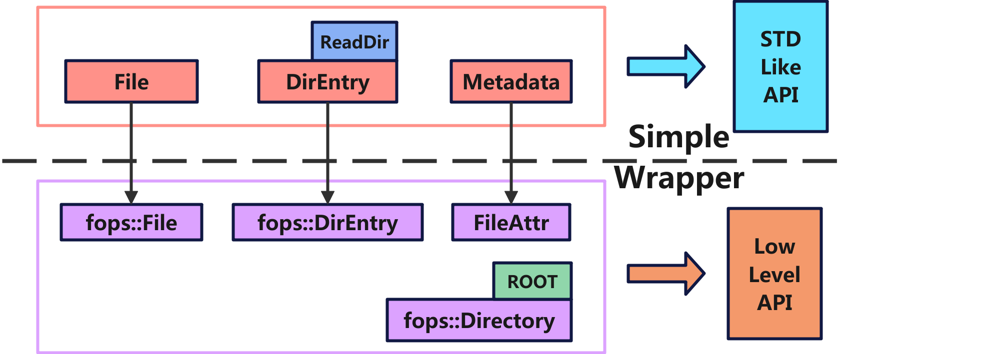

# ArceOS 文件系统接口

本文介绍了 ArceOS 的文件系统接口设计，主要面向使用 `axfs` 模块构建操作系统内核的开发者，涉及的内容包括：

1. 关键结构体与关联函数
2. `std-like` 风格的 API
3. `axfs` 模块中 Features 配置策略

## 关键结构体与关联函数

在 `axfs` 模块中，主要有以下几个关键结构体：

- `File`：具体的文件对象，提供了对文件的打开和读写等操作。
- `Directory`：具体的目录对象，提供了对目录的增删改查等操作。
- `DirEntry`：目录项，用于表示目录中的文件名和类型等信息。
- `FileAttr`：文件属性，包括文件类型、权限、大小等信息。

### FILE 文件操作

`File` 结构体表示打开的文件对象，提供了对文件的读写等操作：

- `node`：对应的文件节点的引用，是一个 `WithCap` 包装的 `VfsNodeRef`。
- `is_append`：表示文件是否以追加模式打开。例如 `open("/tmp/xxx", "a")` 打开文件时，`is_append` 为 `true`，并且 `offset` 指向文件末尾。
- `offset`：文件指针，表示文件的读写位置。

```rust
/// An opened file object, with open permissions and a cursor.
pub struct File {
    node: WithCap<VfsNodeRef>,
    is_append: bool,
    offset: u64,
}
```

!!! caution "权限控制 `WithCap`"

    `WithCap` 增加了对文件的访问权限控制的功能，包含可读、可写、可执行（rwx）。具体参考[cap_access](https://github.com/arceos-org/cap_access)。

`File` 实现了如下的函数：

```rust
// modules/axfs/src/fops.rs

/// 相对于当前目录打开文件，返回 `File` 对象
pub fn open(path: &str, opts: &OpenOptions) -> AxResult<Self>;

/// 将文件截断或扩展到指定大小，若文件小于指定大小，则在文件末尾填充 `\0`
pub fn truncate(&self, size: u64) -> AxResult;

/// 从当前位置读取文件内容到缓冲区，返回读取的字节数，更新文件指针 
pub fn read(&mut self, buf: &mut [u8]) -> AxResult<usize>;

/// 从指定位置读取文件内容到缓冲区，返回读取的字节数，不更新文件指针
pub fn read_at(&self, offset: u64, buf: &mut [u8]) -> AxResult<usize>;

/// 从当前位置写入缓冲区内容到文件，返回写入的字节数，更新文件指针
pub fn write(&mut self, buf: &[u8]) -> AxResult<usize>;

/// 从指定位置写入缓冲区内容到文件，返回写入的字节数，不更新文件指针
pub fn write_at(&self, offset: u64, buf: &[u8]) -> AxResult<usize>;

/// 将文件缓冲区数据刷新到底层设备
pub fn flush(&self) -> AxResult;

/// 设置文件指针到指定位置，返回新的位置
pub fn seek(&mut self, pos: SeekFrom) -> AxResult<u64>;

/// 获取文件的属性，返回 `FileAttr` 结构体，包含文件的权限、类型、大小等信息。
pub fn get_attr(&self) -> AxResult<FileAttr>;
```

在这里，我们需要注意的是，由于没有进行更多的封装，`axfs` 不像标准库一样地智能，所以在使用 `write` 过后需要调用 `flush` 函数来确保数据持久化到设备中。

除此之外，只有 `File` 被 `drop` 触发**析构函数**，强制刷新文件的缓冲区数据才能够进行同步。

下面是一个简单的使用示例：
```rust
/// 创建一个 OpenOptions 对象
fn options(opt: &str) -> fops::OpenOptions {
    let mut opts = fops::OpenOptions::new();
    opt.find("r").map(|_| opts.read(true));
    opt.find("w").map(|_| opts.write(true));
    opt.find("x").map(|_| opts.execute(true));
    opt.find("a").map(|_| opts.append(true));
    opt.find("t").map(|_| opts.truncate(true));
    opt.find("c").map(|_| opts.create(true));
    opt.find("n").map(|_| opts.create_new(true));
    opt.find("d").map(|_| opts.directory(true));
    opts
}

fn file() -> AxResult {
    let s = String::from("hello world");
    let s_append = String::from(" arceOS!");
    let file_path = "/test.txt";
    
    // write: 写入文件
    let mut file = fops::File::open(file_path, &options("rwc"))?;
    file.write(s.as_bytes())?;
    drop(file); // 触发析构函数，刷新文件缓冲区数据
    // file.flush()?;

    // read: 读取文件
    let mut file = fops::File::open(file_path, &options("r"))?;
    let mut buf = [0u8; 64];
    let len = file.read(&mut buf)?;
    assert_eq!(&buf[0..len], s.as_bytes());

    // write_append: 追加文件
    let mut file = fops::File::open(file_path, &options("rwa"))?;
    file.write(s_append.as_bytes())?;
    drop(file); // 触发析构函数，刷新文件缓冲区数据
    // file.flush()?;

    // seek: 定位文件指针
    let mut file = fops::File::open(file_path, &options("r"))?;
    file.seek(SeekFrom::Start(6))?;
    let mut buf = [0u8; 64];
    let len = file.read(&mut buf)?;
    assert_eq!(buf[0..len], format!("{}{}", s, s_append).as_bytes()[6..]);

    // get_attr: 获取文件的元数据
    let metadata = file.get_attr()?;
    assert_eq!(metadata.file_type(), fops::FileType::File);
    assert_eq!(metadata.size(), 19);

    // 删除文件
    let dir = fops::Directory::open_dir("/", &options("r"))?;   
    dir.remove_file(file_path)?;
    
    Ok(())
}
```

### Directory 目录操作

`Directory` 结构体表示打开的目录对象，提供了对目录的增删改查等操作：

- `node`：对应的目录节点的引用，是一个 `WithCap` 包装的 `VfsNodeRef`。
- `entry_idx`：表示当前目录项的索引位置。

```rust
/// An opened directory object, with open permissions and a cursor for
/// [`read_dir`](Directory::read_dir).
pub struct Directory {
    node: WithCap<VfsNodeRef>,
    entry_idx: usize,
}
```

`Directory` 实现了如下的函数：
```rust
// modules/axfs/src/fops.rs

/// 相对于当前目录打开目录，返回 `Directory` 对象
pub fn open_dir(path: &str, opts: &OpenOptions) -> AxResult<Self>;

/// 相对于此目录打开目录，返回 `Directory` 对象
pub fn open_dir_at(&self, path: &str, opts: &OpenOptions) -> AxResult<Self>;

/// 相对于此目录打开文件，返回 `File` 对象
pub fn open_file_at(&self, path: &str, opts: &OpenOptions) -> AxResult<File>;

/// 在此目录下创建空文件
pub fn create_file(&self, path: &str) -> AxResult<VfsNodeRef>;

/// 在此目录下创建空目录
pub fn create_dir(&self, path: &str) -> AxResult;

/// 移除在此目录下的文件
pub fn remove_file(&self, path: &str) -> AxResult;

/// 移除在此目录下的指定目录
pub fn remove_dir(&self, path: &str) -> AxResult;

/// 从当前位置开始读取目录条目到缓冲区，返回读取的条目数，更新目录指针
pub fn read_dir(&mut self, dirents: &mut [DirEntry]) -> AxResult<usize>;

/// 重命名文件或目录，若新路径已存在则删除原文件，要求新旧路径必须在同一文件系统中
pub fn rename(&self, old: &str, new: &str) -> AxResult;
```

在这里，我们需要注意的是，`rename` 函数不是基于 `self` 的路径，而是基于当前目录的路径进行重命名操作，当前路径可以调用 `api::current_dir()` 获得。

下面是一个简单的使用示例：
```rust
/// 检测文件/目录是否存在
fn check_exsist(path: &str, assertion: bool) {
    debug!("{} exsist: {}", path, assertion);
    assert_eq!(api::absolute_path_exists(path), assertion);
}

/// 测试目录 API
fn direction() -> AxResult {
    let root_dir = fops::Directory::open_dir("/", &options("r"))?;
    
    // create_dir: 创建文件夹 /test
    root_dir.create_dir("test")?; check_exsist("/test", true);
    
    let dir = fops::Directory::open_dir("/test", &options("r"))?;
    
    // create_file: 创建文件 /test/test_a.txt /test/test_b.txt
    dir.create_file("test_a.txt")?; check_exsist("/test/test_a.txt", true);
    dir.create_file("test_b.txt")?; check_exsist("/test/test_b.txt", true);

    // rename: 修改文件名 /test/test_a.txt -> /test/test_c.txt
    api::set_current_dir("/test").expect("set current dir failed");
    dir.rename("test_a.txt", "test_c.txt")?;
    check_exsist("test_a.txt", false);
    check_exsist("test_c.txt", true);
    api::set_current_dir("/").expect("set current dir failed");
    
    // remove_file: 删除文件 /test/test_b.txt /test/test_c.txt 
    dir.remove_file("test_b.txt")?;
    check_exsist("/test/test_b.txt", false);
    dir.remove_file("test_c.txt")?;
    check_exsist("/test/test_c.txt", false);

    // remove_dir 删除文件夹 /test
    root_dir.remove_dir("test")?;
    check_exsist("/test", false);

    Ok(())
}
```

### DirEntry 目录项

`DirEntry` 结构体表示目录项，其中包含了文件名和文件属性等信息。它是 `axfs_vfs::VfsDirEntry` 的别名。

目前内部记录两个字段：

- `d_type`：表示文件类型，为 `VfsNodeType` 枚举类型。
- `d_name`：表示文件名，使用一个长度为 63 的字节数组存储文件名。

```rust
/// Alias of [`axfs_vfs::VfsDirEntry`].
pub type DirEntry = axfs_vfs::VfsDirEntry;

/// Directory entry.
pub struct VfsDirEntry {
    d_type: VfsNodeType,
    d_name: [u8; 63],
}
```

!!! caution "文件名长度限制"

    目前 Arceos 中的文件名长度限制为 63 字节，实际使用中可能会遇到一些问题，例如 `lwext4` 文件系统中，文件名长度限制为 255 字节，因此在使用 `lwext4` 文件系统时，可能会遇到文件名过长的问题。

### OpenOptions 打开选项

`OpenOptions` 结构体用于指定打开文件或目录时的选项。类似于 Rust 标准库中的 [std::fs::OpenOptions](https://doc.rust-lang.org/std/fs/struct.OpenOptions.html)。不过，考虑到 ArceOS 的特殊性，`OpenOptions` 结构体提供了更多的选项来配置文件的打开方式。

```rust
/// Options and flags which can be used to configure how a file is opened.
#[derive(Default, Clone)]
pub struct OpenOptions {
    // generic
    read: bool,         // 是否可读
    write: bool,        // 是否可写
    execute: bool,      // 是否可执行
    append: bool,       // 是否以追加模式打开，若为 true，写入操作将追加到文件末尾而非覆盖原有内容。
    truncate: bool,     // 是否截断文件，若为 true，打开文件时将清空其内容（文件大小置为 0）。
    create: bool,       // 是否创建文件，即使文件已存在也不会返回错误
    create_new: bool,   // 是否创建新文件，若文件已存在则返回错误
    directory: bool,    // 是否打开目录，若为 true，尝试将路径作为目录打开（而非文件）
    // system-specific
    _custom_flags: i32,
    _mode: u32,
}
```

### 元数据

在 `axfs` 模块中，文件和目录的元数据的接口是通过 `FileAttr` 结构体来实现的。内部包含了文件的权限、类型、大小和分配的块数等信息。它是 `axfs_vfs::VfsNodeAttr` 的别名。内部维护了以下字段：

1. `mode`：文件权限模式，使用 `FilePerm` 类型表示。描述了文件的访问权限，包括所有者、组和其他用户的读、写和执行权限。
2. `ty`：文件类型，使用 `FileType` 类型表示。
3. `size`：文件的总大小，以字节为单位。
4. `blocks`：分配的块数，以 512 字节为单位。

```rust
/// Alias of [`axfs_vfs::VfsNodeAttr`].
pub type FileAttr = axfs_vfs::VfsNodeAttr;
/// Alias of [`axfs_vfs::VfsNodePerm`].
pub type FilePerm = axfs_vfs::VfsNodePerm;
/// Alias of [`axfs_vfs::VfsNodeType`].
pub type FileType = axfs_vfs::VfsNodeType;

/// Node (file/directory) attributes.
pub struct VfsNodeAttr {
    /// File permission mode.
    mode: VfsNodePerm,
    /// File type.
    ty: VfsNodeType,
    /// Total size, in bytes.
    size: u64,
    /// Number of 512B blocks allocated.
    blocks: u64,
}

pub enum VfsNodeType {
    /// FIFO (named pipe)
    Fifo = 0o1,
    /// Character device
    CharDevice = 0o2,
    /// Directory
    Dir = 0o4,
    /// Block device
    BlockDevice = 0o6,
    /// Regular file
    File = 0o10,
    /// Symbolic link
    SymLink = 0o12,
    /// Socket
    Socket = 0o14,
}

bitflags::bitflags! {
    /// Node (file/directory) permission mode.
    #[derive(Debug, Clone, Copy)]
    pub struct VfsNodePerm: u16 {
        /// Owner has read permission.
        const OWNER_READ = 0o400;
        /// Owner has write permission.
        const OWNER_WRITE = 0o200;
        /// Owner has execute permission.
        const OWNER_EXEC = 0o100;

        /// Group has read permission.
        const GROUP_READ = 0o40;
        /// Group has write permission.
        const GROUP_WRITE = 0o20;
        /// Group has execute permission.
        const GROUP_EXEC = 0o10;

        /// Others have read permission.
        const OTHER_READ = 0o4;
        /// Others have write permission.
        const OTHER_WRITE = 0o2;
        /// Others have execute permission.
        const OTHER_EXEC = 0o1;
    }
}
```

`axfs` 模块提供了对文件、目录进行直接操作的接口，现在只需要将根目录 `ROOT` 暴露给开发者就可以得到一个完整的文件系统 API 了。


## `std-like` API

除了上一节中操作文件/目录 API 外，ArceOS 还提供了一套类似于 Rust 标准库的文件系统 API，这样也简化了开发者在 ArceOS 基础上实现 rust 标准库的工作。
参考 [rust 官方 std::fs](https://doc.rust-lang.org/std/fs/index.html)

本质上，`std-like` API 是对下层模块的进一步封装。



```rust
// modules/axfs/src/api/mod.rs

/// 返回一个目录项迭代器
pub fn read_dir(path: &str) -> io::Result<ReadDir>;

/// 返回规范化的绝对路径
pub fn canonicalize(path: &str) -> io::Result<String>;

/// 返回当前工作目录
pub fn current_dir() -> io::Result<String>;

/// 更改当前工作目录
pub fn set_current_dir(path: &str) -> io::Result<()>;

/// 将文件的全部内容读入字节向量
pub fn read(path: &str) -> io::Result<Vec<u8>>;

/// 将文件的全部内容读入字符串
pub fn read_to_string(path: &str) -> io::Result<String>;

/// 将切片内容全部写入文件中
pub fn write<C: AsRef<[u8]>>(path: &str, contents: C) -> io::Result<()>;

/// 查询文件系统获取文件、目录等的信息
pub fn metadata(path: &str) -> io::Result<Metadata>;

/// 创建一个空目录
pub fn create_dir(path: &str) -> io::Result<()>;

/// 递归创建目录及其所有父目录（目前不支持）
pub fn create_dir_all(path: &str) -> io::Result<()>;

/// 删除指定空目录
pub fn remove_dir(path: &str) -> io::Result<()>;

/// Removes a file from the filesystem.
pub fn remove_file(path: &str) -> io::Result<()>;

/// 重命名文件或目录，若新路径已存在则删除原文件
pub fn rename(old: &str, new: &str) -> io::Result<()>;

/// 检查路径是否存在
pub fn absolute_path_exists(path: &str) -> bool;
```

上面的 API 可以分为以下三个部分，目前除了 `create_dir_all` 之外都已经实现了：

1. 文件操作：`read`、`read_to_string`、`write`、`remove_file`。
2. 目录操作：`read_dir`、`create_dir`、`create_dir_all`、`remove_dir`。
3. 其他操作：`metadata`、`canonicalize`、`absolute_path_exists`、`current_dir`、`set_current_dir`、`rename`。


下面是一个简单的使用示例：
```rust
/// 输出目录下的文件列表
fn do_ls(dir_path: &str) {
    info!("do_ls in {}", dir_path);
    api::read_dir(dir_path)
        .expect("read dir failed")
        .enumerate()
        .for_each(|(i, entry)| {
            let entry = entry.expect("read dir failed");
            info!("{} {}", i, entry.file_name());
        });
}

fn std_like_api() -> axio::Result {
    do_ls("/"); // 输出根目录下的文件列表

    let file_name = "test.txt";
    let s = String::from("hello world");

    // canonicalize: 路径规范化
    assert_eq!(api::canonicalize("/path/./to//foo")?, "/path/to/foo");
    
    // current_dir: 获取当前目录
    let current_dir = api::current_dir()?;
    assert_eq!(current_dir, "/");

    // create_dir: 创建目录
    api::create_dir("/test")?;
    check_exsist("/test", true);

    // // create_dir_all: 递归创建目录（暂时不支持）
    // api::create_dir_all("/test/b/c/d")?;
    // check_exsist("/test/b/c/d", true);

    // set_current_dir: 设置当前目录
    api::set_current_dir("/test")?;
    api::current_dir().map(|dir| assert_eq!(dir, "/test/"))?;

    // write: 写入文件
    api::write(file_name, &s)?;
    check_exsist("/test/test.txt", true);

    // read: 读取文件
    let res = api::read(file_name)?;
    assert_eq!(res, s.as_bytes());

    // read_to_string: 读取文件到字符串
    let res = api::read_to_string(file_name)?;
    assert_eq!(res, s);

    // rename: 重命名文件
    api::rename(file_name, "test_renamed.txt")?;
    check_exsist("/test/test.txt", false);
    check_exsist("/test/test_renamed.txt", true);

    // read_dir: 查看当前目录下的文件列表
    do_ls("/test");

    // remove_file: 删除文件
    api::remove_file("test_renamed.txt")?;
    check_exsist("/test/test_renamed.txt", false);
    
    // remove_dir: 删除目录
    api::set_current_dir("/")?;
    api::remove_dir("test")?;
    check_exsist("/test", false);

    Ok(())
}
```

!!! caution "基本元件 `axio`"

    这里的 io 是 [axio](https://github.com/arceos-org/axio)，它类似于 Rust 标准库的 `std::io`，提供了在 `no_std` 环境下基本 IO 操作的接口。
    `axio` 属于 ArceOS 的基本元件之一，作为一个独立的 crate 发布，类似的元件还有 [axfs_crates](https://github.com/arceos-org/axfs_crates), 
    [axmm_crates](https://github.com/arceos-org/axmm_crates) 等。体现了 ArceOS 的模块化设计理念。


## Features 配置策略

从 ArceOS 的设计理念来看，文件系统的选择是一个重要的设计决策，因此在模块层的 `axfs` 中，为用户内核提供了 `features` 配置，静态选择所需的文件系统，进行初始化并挂载。

```toml
# modules/axfs/Cargo.toml
[features]
devfs = ["dep:axfs_devfs"]
ramfs = ["dep:axfs_ramfs"]
procfs = ["dep:axfs_ramfs"]
sysfs = ["dep:axfs_ramfs"]
lwext4_rs = ["dep:lwext4_rust"]
fatfs = ["dep:fatfs"]
myfs = ["dep:crate_interface"]
use-ramdisk = []

default = ["devfs", "ramfs", "fatfs", "procfs", "sysfs"]
```

### 特殊的文件系统

ArceOS 是一个兼容 linux 接口的组件化内核，因此需要挂载 `devfs`、`procfs` 和 `sysfs` 三个特殊的文件系统：

1. `devfs`：设备文件系统，提供了对设备的访问接口，目前的 `devfs` 仅实现了 `/dev/null` 和 `/dev/zero` 设备文件，具体参考[axfs_vfs::axfs_devfs](https://github.com/arceos-org/axfs_crates/tree/main/axfs_devfs)。
2. `procfs`：是一个基于内存的文件系统，提供了对进程信息的访问接口，目前的实现有待开发中。
3. `sysfs`：系统文件系统，提供了对系统信息的访问接口，目前有待开发中。

这些文件系统是内核的一部分，提供了对内核数据结构的访问接口，用于在内核和用户空间之间传递特定信息或实现特定功能。

如果在 Arceos 中启用了 `axfs` 模块的 feature，那么初始化文件系统时，会在根目录中对它们进行挂载。

```rust
pub(crate) fn init_rootfs(disk: crate::dev::Disk) {
    // ...

    #[cfg(feature = "devfs")]
    root_dir
        .mount("/dev", mounts::devfs())
        .expect("failed to mount devfs at /dev");

    #[cfg(feature = "ramfs")]
    root_dir
        .mount("/tmp", mounts::ramfs())
        .expect("failed to mount ramfs at /tmp");

    // Mount another ramfs as procfs
    #[cfg(feature = "procfs")]
    root_dir // should not fail
        .mount("/proc", mounts::procfs().unwrap())
        .expect("fail to mount procfs at /proc");

    // Mount another ramfs as sysfs
    #[cfg(feature = "sysfs")]
    root_dir // should not fail
        .mount("/sys", mounts::sysfs().unwrap())
        .expect("fail to mount sysfs at /sys");

    // ...
}
```

### 根文件系统

根文件系统是操作系统的基础文件系统，其他文件系统都需要挂载在根文件系统上。

在 ArceOS 中，开发者通过改变 feature 选择具体的文件系统类型作为根文件系统。默认情况下，根文件系统选择的优先级顺序依次为 `myfs`、`lwext4_rs`、`fatfs`。如果没有选择任何一个文件系统的 `feature`，则编译错误。

```rust
pub(crate) fn init_rootfs(disk: crate::dev::Disk) {
    cfg_if::cfg_if! {
        if #[cfg(feature = "myfs")] { // override the default filesystem
            let main_fs = fs::myfs::new_myfs(disk);
        } else if #[cfg(feature = "lwext4_rs")] {
            static EXT4_FS: LazyInit<Arc<fs::lwext4_rust::Ext4FileSystem>> = LazyInit::new();
            EXT4_FS.init_once(Arc::new(fs::lwext4_rust::Ext4FileSystem::new(disk)));
            let main_fs = EXT4_FS.clone();
        } else if #[cfg(feature = "fatfs")] {
            static FAT_FS: LazyInit<Arc<fs::fatfs::FatFileSystem>> = LazyInit::new();
            FAT_FS.init_once(Arc::new(fs::fatfs::FatFileSystem::new(disk)));
            FAT_FS.init();
            let main_fs = FAT_FS.clone();
        }
    }

    let root_dir = RootDirectory::new(main_fs);

    // ...
}
```

### 使用自定义的文件系统

ArceOS 允许开发者在用户内核中使用自定义的文件系统，只需要完成两个步骤：

1. 在用户应用的 `Cargo.toml` 中添加对 `myfs` 的 feature，一般通过对 `axstd/myfs` 的依赖来实现。
2. 实现 `MyFileSystemIfImpl` 接口

```rust
/// The interface to define custom filesystems in user apps.
#[crate_interface::def_interface]
pub trait MyFileSystemIf {
    /// Creates a new instance of the filesystem with initialization.
    ///
    /// TODO: use generic disk type
    fn new_myfs(disk: Disk) -> Arc<dyn VfsOps>;
}

pub(crate) fn new_myfs(disk: Disk) -> Arc<dyn VfsOps> {
    crate_interface::call_interface!(MyFileSystemIf::new_myfs(disk))
}
```

这里 `#[crate_interface::def_interface]` 是 [crate_interface](https://github.com/Starry-OS/crate_interfaces) 提供的宏，通过在链接时通过符号将接口的定义和实现连接起来实现了依赖注入。最后，从用户视角看 `modules/axfs/src/fs/myfs.rs` 会成功转换为用户内核中定义的具体实现。


下面以 ArceOS 项目下的 `examples/shell` 为例，演示如何使用自定义的文件系统。

1. 添加对 `myfs` 的依赖
    ```toml
    # examples/shell/Cargo.toml

    [features]
    use-ramfs = ["axstd/myfs", "dep:axfs_vfs", "dep:axfs_ramfs", "dep:crate_interface"]
    default = []

    [dependencies]
    axfs_vfs = { version = "0.1", optional = true }
    axfs_ramfs = { version = "0.1", optional = true }
    crate_interface = { version = "0.1", optional = true }
    axstd = { workspace = true, features = ["alloc", "fs"], optional = true }
    ```

2. 实现 `MyFileSystemIfImpl` 接口
    ```rust
    // examples/shell/src/ramfs.rs

    struct MyFileSystemIfImpl;

    #[crate_interface::impl_interface]
    impl MyFileSystemIf for MyFileSystemIfImpl {
        fn new_myfs(_disk: AxDisk) -> Arc<dyn VfsOps> {
            Arc::new(RamFileSystem::new())
        }
    }
    ```

随后，当 ArceOS 启动时，会自动调用 `MyFileSystemIfImpl::new_myfs` 函数来创建文件系统实例，并将其挂载到根目录上。

```rust
pub(crate) fn init_rootfs(disk: crate::dev::Disk) {
    cfg_if::cfg_if! {
        if #[cfg(feature = "myfs")] { // override the default filesystem
            let main_fs = fs::myfs::new_myfs(disk);
        } else if #[cfg(feature = "lwext4_rs")] {
            // ...
        } else if #[cfg(feature = "fatfs")] {
            // ...
        }
    }

    let root_dir = RootDirectory::new(main_fs);
}
```
