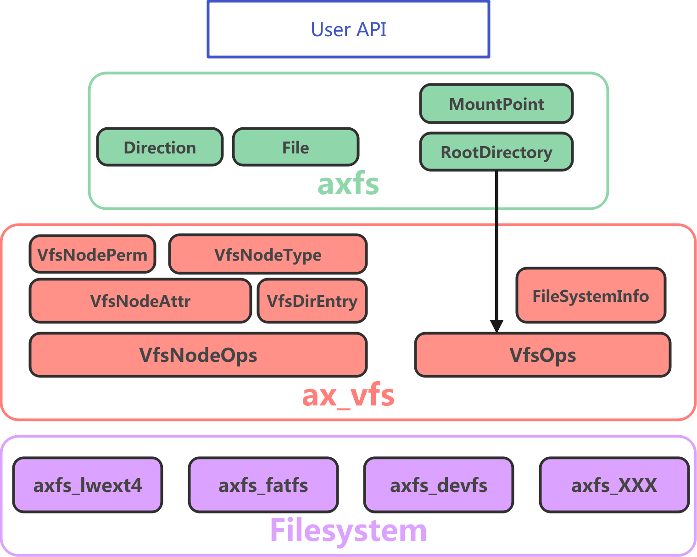

# ArceOS 文件系统实现

在 ArceOS 中，文件系统至少分为三层：

1. **文件系统实现层**：包括具体的文件系统实现，如 `ramfs`、`devfs`、`fatfs` 和 `ext4` 等
2. **文件系统兼容层**：提供了一个统一的对象 `dyn VfsNodeOps` 供上层调用，下层的具体的文件系统只需要实现 `VfsOps` 和 `VfsNodeOps` trait 即可接入 ArceOS 的文件系统框架中
3. **用户接口层**：最终提供给用户的文件系统 API



## 文件系统兼容层

ArceOS 提供了一个文件系统的兼容层，它向底层的具体的文件系统提供了一个统一的接口，使得文件系统只需要实现具体的 `trait` 即可接入 ArceOS 的文件系统框架中。

大致可以划分为以下两个部分：

1. `axfs_vfs` 主要为下层具体的文件系统提供需要实现的接口。
2. `axfs` 封装 `axfs_vfs` 中的 `VfsOps` 和 `VfsNodeOps` trait，面向用户提供文件系统更高层次的抽象。

### 虚拟文件系统接口

`axfs_vfs`模块中有两个核心的 trait，分别是 `VfsOps` 和 `VfsNodeOps`，这两个 trait 的实现是文件系统接入 ArceOS 的关键。

- **trait VfsNodeOps**：定义了文件系统节点的基本操作，如打开、读取、写入、删除等，是文件系统中节点（文件/目录）的核心接口：

```rust
/// Node (file/directory) operations.
pub trait VfsNodeOps: Send + Sync {
    /// Do something when the node is opened.
    fn open(&self) -> VfsResult;
    /// Do something when the node is closed.
    fn release(&self) -> VfsResult;
    /// Get the attributes of the node.
    fn get_attr(&self) -> VfsResult<VfsNodeAttr>;


    // file operations:

    /// Read data from the file at the given offset.
    fn read_at(&self, _offset: u64, _buf: &mut [u8]) -> VfsResult<usize>;
    /// Write data to the file at the given offset.
    fn write_at(&self, _offset: u64, _buf: &[u8]) -> VfsResult<usize>;
    /// Flush the file, synchronize the data to disk.
    fn fsync(&self) -> VfsResult;
    /// Truncate the file to the given size.
    fn truncate(&self, _size: u64) -> VfsResult;


    // directory operations:

    /// Get the parent directory of this directory.
    ///
    /// Return `None` if the node is a file.
    fn parent(&self) -> Option<VfsNodeRef>;
    /// Lookup the node with given `path` in the directory.
    ///
    /// Return the node if found.
    fn lookup(self: Arc<Self>, _path: &str) -> VfsResult<VfsNodeRef>;
    /// Create a new node with the given `path` in the directory
    ///
    /// Return [`Ok(())`](Ok) if it already exists.
    fn create(&self, _path: &str, _ty: VfsNodeType) -> VfsResult;
    /// Remove the node with the given `path` in the directory.
    fn remove(&self, _path: &str) -> VfsResult;
    /// Read directory entries into `dirents`, starting from `start_idx`.
    fn read_dir(&self, _start_idx: usize, _dirents: &mut [VfsDirEntry]) -> VfsResult<usize>;
    /// Renames or moves existing file or directory.
    fn rename(&self, _src_path: &str, _dst_path: &str) -> VfsResult;


    /// Convert `&self` to [`&dyn Any`][1] that can use
    /// [`Any::downcast_ref`][2].
    ///
    /// [1]: core::any::Any
    /// [2]: core::any::Any#method.downcast_ref
    fn as_any(&self) -> &dyn core::any::Any;
}
```

上面的代码可以分为四个部分：

1. 节点操作：`open`、`release`、`get_attr`
2. 文件操作：`read_at`、`write_at`、`fsync`、`truncate`
3. 目录操作：`parent`、`lookup`、`create`、`remove`、`read_dir`、`rename`
4. 其他操作：`as_any`

这里解释其中的几个函数：

1. `get_attr`：获取节点的属性，返回 `VfsNodeAttr`，包含节点的文件类型、大小、读写权限等信息
2. `truncate`：调整文件的大小到指定大小，如果指定大小小于当前文件大小，则会丢弃多余的部分；若果指定大小大于当前文件大小，则会在文件末尾添加空字节（`\0`）
3. `lookup`：在当前目录下查找指定路径的节点，返回节点的引用
4. `read_dir`：读取当前目录下的 `VfsDirEntry`，返回读取的数量
5. `as_any`：将当前节点转换为 `&dyn Any`，以便于后续的类型转换

---

- **trait VfsOps**：定义了文件系统的基本操作，如挂载、卸载、获取根节点等，是文件系统的入口接口：

```rust
/// Filesystem operations.
pub trait VfsOps: Send + Sync {
    /// Do something when the filesystem is mounted.
    fn mount(&self, _path: &str, _mount_point: VfsNodeRef) -> VfsResult;
    /// Do something when the filesystem is unmounted.
    fn umount(&self) -> VfsResult;
    /// Format the filesystem.
    fn format(&self) -> VfsResult;
    /// Get the attributes of the filesystem.
    fn statfs(&self) -> VfsResult<FileSystemInfo>;
    /// Get the root directory of the filesystem.
    fn root_dir(&self) -> VfsNodeRef;
}
```

上面的代码，这里解释其中的三个函数：

- `format`：对磁盘进行文件系统格式化
- `statfs`：获取文件系统的基本信息（目前没有被使用）
- `root_dir`：获取当前文件系统的根目录

### 用户视角的文件系统

现在 `axfs_vfs` 已经定义了文件系统的基本操作，接下来我们需要将虚拟文件系统提供的抽象封装成用户可以直接使用的接口。

`axfs` 模块中定义了 `File` 和 `Directory` 结构体，分别表示打开的文件和目录对象，调用该模块的用户会直接使用这两个结构体来进行文件和目录的操作。

这两个结构体是对 `VfsNodeRef` 的封装，它们在封装的同时也增加了一些功能：

1. 使用 `WithCap` 包装，增加了对文件和目录的权限控制功能，内部简单添加了可读、可写、可执行的权限控制功能，具体参考[cap_access](https://github.com/arceos-org/cap_access)。
2. `is_append`：表示文件是否以追加模式打开。例如 `open("/tmp/xxx", "a")` 打开文件时，`is_append` 为 `true`，并且 `offset` 指向文件末尾。
3. `offset`：表示文件的读写位置。
4. `entry_idx`：表示目录的读写位置。

```rust
/// A wrapper of [`Arc<dyn VfsNodeOps>`].
pub type VfsNodeRef = Arc<dyn VfsNodeOps>;


/// An opened file object, with open permissions and a cursor.
pub struct File {
    node: WithCap<VfsNodeRef>,
    is_append: bool,
    offset: u64,
}

/// An opened directory object, with open permissions and a cursor for
/// [`read_dir`](Directory::read_dir).
pub struct Directory {
    node: WithCap<VfsNodeRef>,
    entry_idx: usize,
}
```

现在只要有根目录，用户就可以通过 `File` 和 `Directory` 结构体来完成针对文件和目录的操作了。


## 接入不同文件系统

ArceOS 目前已经可以使用`ramfs`、`devfs`、`fatfs`和 `ext4` 文件系统了，前两个是虚拟文件系统，是基于内存和设备的文件系统，后两个是基于磁盘的文件系统。

现在以 `fatfs` 为例，介绍如何接入一个新的文件系统，其中 `fatfs` 的具体实现请参考 [rust-fatfs](https://github.com/rafalh/rust-fatfs) 。当然，由于代码量较大，这里只介绍如何接入文件系统的核心部分，具体的实现请参考 `arceos/modules/fs/fatfs.rs`。

### 封装原始数据结构

当前 `trait` 和 `fatfs` 的结构体都不在当前模块中，因此不可能直接进行 `impl`，同时由于我们需要添加 `Mutex` 来实现多线程安全，所以我们必须要对 `fatfs` 的数据结构进行一层封装。
```rust
pub struct FatFileSystem {
    inner: fatfs::FileSystem<Disk, NullTimeProvider, LossyOemCpConverter>,
    root_dir: UnsafeCell<Option<VfsNodeRef>>,
}

/// A wrapper of [`fatfs::File`].
pub struct FileWrapper<'a, IO: IoTrait>(Mutex<File<'a, IO, NullTimeProvider, LossyOemCpConverter>>);
/// A wrapper of [`fatfs::Dir`].
pub struct DirWrapper<'a, IO: IoTrait>(Dir<'a, IO, NullTimeProvider, LossyOemCpConverter>);

pub trait IoTrait: Read + Write + Seek {}
```

### 适配虚拟文件系统

这里给出 `FileWrapper` 的实现，`DirWrapper` 的实现也是类似的，同时这里还需要注意以下两点：

首先，第二行 `axfs_vfs::impl_vfs_non_dir_default! {}` 提供了非目录节点的默认实现，主要是 `lookup`、`create`、`remove` 和 `read_dir` 的实现。

其次，`fatfs` 中不支持权限控制，所以我们直接将权限设置为 `0o755`，即 `rwxr-xr-x`。

```rust
impl<IO: IoTrait> VfsNodeOps for FileWrapper<'static, IO> {
    axfs_vfs::impl_vfs_non_dir_default! {}

    fn get_attr(&self) -> VfsResult<VfsNodeAttr> {
        let size = self.0.lock().seek(SeekFrom::End(0)).map_err(as_vfs_err)?;
        let blocks = (size + BLOCK_SIZE as u64 - 1) / BLOCK_SIZE as u64;
        // FAT fs doesn't support permissions, we just set everything to 755
        let perm = VfsNodePerm::from_bits_truncate(0o755);
        Ok(VfsNodeAttr::new(perm, VfsNodeType::File, size, blocks))
    }

    fn read_at(&self, offset: u64, buf: &mut [u8]) -> VfsResult<usize> {
        let mut file = self.0.lock();
        file.seek(SeekFrom::Start(offset)).map_err(as_vfs_err)?;
        file.read(buf).map_err(as_vfs_err)
    }

    fn write_at(&self, offset: u64, buf: &[u8]) -> VfsResult<usize> {
        let mut file = self.0.lock();
        file.seek(SeekFrom::Start(offset)).map_err(as_vfs_err)?;
        file.write(buf).map_err(as_vfs_err)
    }

    fn truncate(&self, size: u64) -> VfsResult {
        let mut file = self.0.lock();
        file.seek(SeekFrom::Start(size)).map_err(as_vfs_err)?;
        file.truncate().map_err(as_vfs_err)
    }
}
```

### 定义文件系统操作对象

在 `fatfs` 的定义中，需要一个实现 `Read`、`Write` 和 `Seek` trait 的结构体来给 `fatfs` 进行操作，这里我们使用 `Disk` 设备来作为被操作的对象。

下面是 `Disk` 对 `Read`、`Write` 和 `Seek` trait 的实现：

```rust
impl fatfs::IoBase for Disk {
    type Error = ();
}

impl IoTrait for Disk {}

impl Read for Disk {
    fn read(&mut self, mut buf: &mut [u8]) -> Result<usize, Self::Error> {
        let mut read_len = 0;
        while !buf.is_empty() {
            match self.read_one(buf) {
                Ok(0) => break,
                Ok(n) => {
                    let tmp = buf;
                    buf = &mut tmp[n..];
                    read_len += n;
                }
                Err(_) => return Err(()),
            }
        }
        Ok(read_len)
    }
}

impl Write for Disk {
    fn write(&mut self, mut buf: &[u8]) -> Result<usize, Self::Error> {
        let mut write_len = 0;
        while !buf.is_empty() {
            match self.write_one(buf) {
                Ok(0) => break,
                Ok(n) => {
                    buf = &buf[n..];
                    write_len += n;
                }
                Err(_) => return Err(()),
            }
        }
        Ok(write_len)
    }
    fn flush(&mut self) -> Result<(), Self::Error> {
        Ok(())
    }
}

impl Seek for Disk {
    fn seek(&mut self, pos: SeekFrom) -> Result<u64, Self::Error> {
        let size = self.size();
        let new_pos = match pos {
            SeekFrom::Start(pos) => Some(pos),
            SeekFrom::Current(off) => self.position().checked_add_signed(off),
            SeekFrom::End(off) => size.checked_add_signed(off),
        }
        .ok_or(())?;
        if new_pos > size {
            warn!("Seek beyond the end of the block device");
        }
        self.set_position(new_pos);
        Ok(new_pos)
    }
}
```

!!! caution "文件系统读写对象"

    我们当然也可以将文件作为读写对象，具体的实现可以参考 `arceos/modules/fs/fatfs.rs` 中的 `struct FatFileSystemFromFile`。

### 文件系统挂载

完成了对 `fatfs` 的封装后，启用 `fatfs` 特性，我们就可以在内核中挂载 `fatfs` 文件系统：
```rust
// modules/axfs/src/root.rs
// fn init_rootfs(disk: crate::dev::Disk);
cfg_if::cfg_if! {
    if #[cfg(feature = "myfs")] { // override the default filesystem
        let main_fs = fs::myfs::new_myfs(disk);
    } else if #[cfg(feature = "lwext4_rs")] {
        static EXT4_FS: LazyInit<Arc<fs::lwext4_rust::Ext4FileSystem>> = LazyInit::new();
        EXT4_FS.init_once(Arc::new(fs::lwext4_rust::Ext4FileSystem::new(disk)));
        let main_fs = EXT4_FS.clone();
    } else if #[cfg(feature = "fatfs")] {
        static FAT_FS: LazyInit<Arc<fs::fatfs::FatFileSystem>> = LazyInit::new();
        FAT_FS.init_once(Arc::new(fs::fatfs::FatFileSystem::new(disk)));
        FAT_FS.init();
        let main_fs = FAT_FS.clone();
    }
}

let root_dir = RootDirectory::new(main_fs);
```
