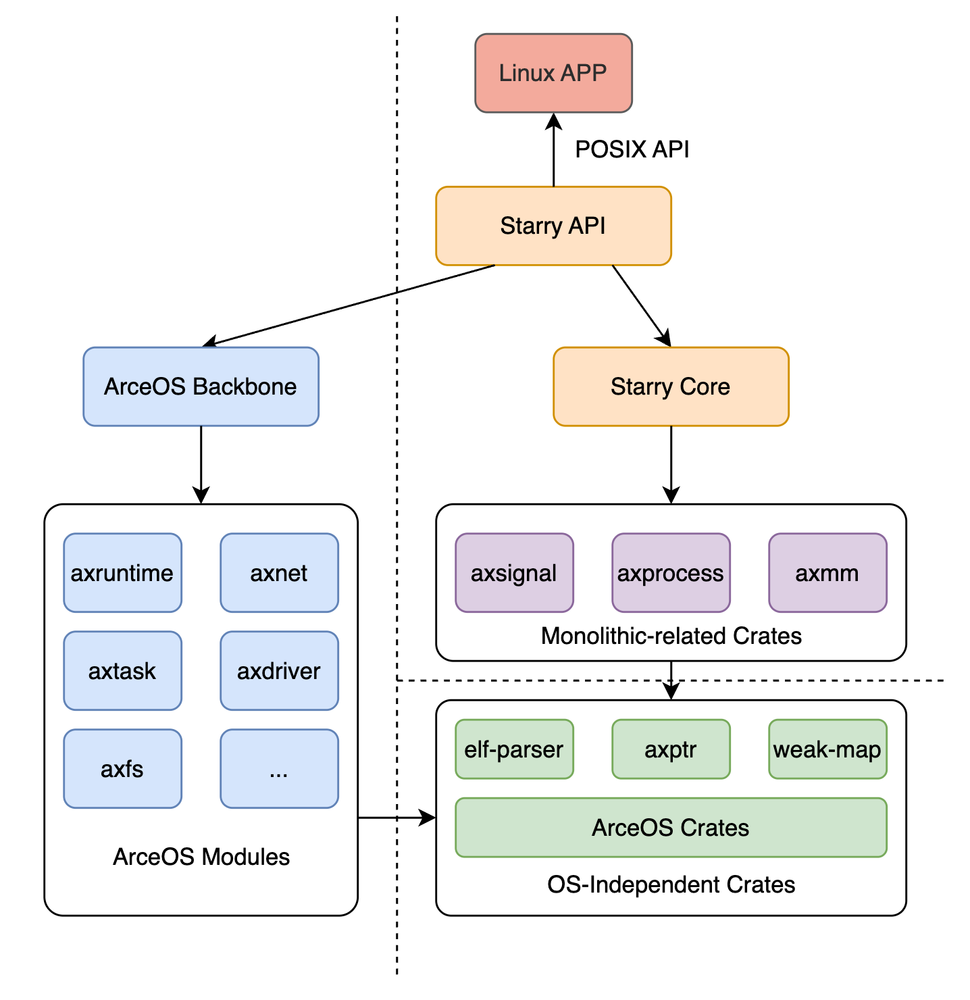

# 欢迎来到 Starry Tutorial Book

Starry 是基于 [ArceOS](https://github.com/arceos-org/arceos) 编写的、兼容 Linux 接口的宏内核（Monolithic Kernel）。它拥有如下特点：

1. 跨平台支持：支持 x86_64/riscv64/aarch64/loongarch64 等多种指令架构，可以运行在星光二代、飞腾派等多种硬件平台上。

2. 安全性：内核完全使用 Rust 语言编写，提供了内存安全、线程安全等多种安全保障。

3. Linux 兼容：对外提供标准的 POSIX 接口

!!! info "Starry 与 ArceOS 之间的关系" 
    不同的形态的内核存在着共性的功能，这些共性恰好可以由最简内核形态：***Unikernel*** 提供。[ArceOS](https://github.com/arceos-org/arceos) 正是一个可定制的 Unikernel ，它预留了扩展为宏内核所需的接口和配置文件，可以作为宏内核 Starry 的基本框架和执行环境，即 ***Kernel Backbone***。宏内核与 Unikernel 的对比如下表所示：

    

    |            | ArceOS |  Starry |
    |------------| ------- | ------- |
    | 内核类型  | Unikernel | 宏内核|
    | 特权模式 |特权级 + 用户级 | 仅特权级 |
    | 资源所有权|全局所有| 各个进程独立拥有|
    | 调用内核提供的服务 |直接通过函数调用| 由系统调用(syscall)实现|

    

## Starry 的设计目标
Starry 的设计目标是按照灵活内核设计原则，实现 ArceOS 的宏内核扩展。其特性功能应当包括完善的进程管理、信号处理、POSIX API 实现等各种功能。

Starry 的实现划分为三大部分（见下图）：

1. Starry Core: 仅负责完成一个基本的宏内核应当具备的功能：特权级切换、进程粒度的资源隔离等。
2. Starry API: 它会调用底层ArceOS 和 Starry Core 中的各种功能，并将它们封装为标准的 POSIX 接口。当接收到用户的 syscall 请求时，Starry 会将其转发给 Starry API 层进行处理，从而实现兼容 Linux Application 的目标。
3. Starry Crates: Starry 抽象出来的模块组件, 与内核无关且可以被被其他内核复用。

