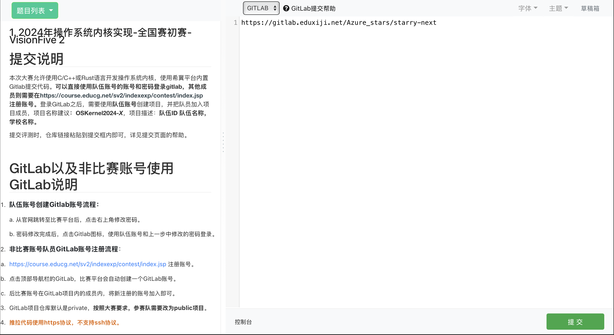

# 在 OS 比赛上测试 Starry

本章节将介绍如何在 [gitlab](https://gitlab.eduxiji.net) 上配置 starry-next 的环境，从而能够使用 OS 比赛的自动评测机制完成对 Starry 的测试。


github 的测试环境搭建与 OS 比赛评测不同，因此不在本章节进行介绍。

## OS 比赛介绍
本章节所提到的比赛是指[全国大学生计算机系统能力大赛内核实现赛](https://os.educg.net/#/index?TYPE=MN_KER)，简称 OS 比赛内核实现赛道。该赛道主要考察内核的功能实现，要求内核运行给定的测试用例，并根据通过测例的数量获得相应的分数。


## OS 赛事环境介绍 —— 初赛
我们以 [2024年操作系统内核实现-全国赛初赛-VisionFive 2](https://course.educg.net/sv2/indexexp/contest/contest_submit.jsp?contestID=JiNfW8HDdzk&my=false&contestCID=0#contestSubAn) 为例介绍初赛的执行环境和评测相关流程。

评测相关的环境包括 riscv64 和 loongarch64，由于 Starry 目前暂不支持 loongarch64 架构，因此我们只介绍 riscv64 架构的评测环境。

### 评测环境

执行环境由 Docker 构建而成，相关的 dockerfile 可见[该链接](https://gitlab.educg.net/wangmingjian/os-contest-2024-image/-/blob/master/Dockerfile)。该文档撰写时所描述的环境对应该 [commit](https://gitlab.educg.net/wangmingjian/os-contest-2024-image/-/tree/2d302c493f7be85ec4f36a4ab175b960e935dabc)。

docker 镜像实例为 docker.educg.net/cg/os-contenst:20250119，其包括如下关键内容：

- Ubuntu: 22.04
- Rust: nightly-2024-02-03 + nightly-2025-01-18
- qemu-system-riscv64: 7.0.0
- (SiFive GCC 8.3.0-2020.04.0) 8.3.0: https://github.com/loboris/ktool/tree/master/kendryte-toolchain/bin

具体其他的相关依赖详见在线网站说明或 docker 镜像实例。


### 评测流程

当在比赛平台上提交了内核代码所在的仓库 URL 之后（点击上图的**提交**按钮之后），平台会执行如下流程开始进行评测：

1. 拉取内核仓库的代码

2. 自动在项目根目录中执行`make all`命令，期望生成 sbi-qemu 和 kernel-qemu 两个文件，即与 xv6-k210 运行 qemu 时的方式一致。

   > 如果你的系统使用默认SBI，则不需要生成 sbi-qemu 文件，运行 QEMU 时会自动设置 -bios 参数为 default。

3. 评测机会将测例所打包成的镜像拷贝到根目录下，SD 卡镜像为 FAT32 文件系统，没有分区表。在 SD 卡镜像的根目录里包含若干个预先编译好的 ELF 可执行文件（以下简称测试点）。

4. 启动 QEMU，开始运行内核并且读取 SD 卡镜像进行测试。运行指令如下：

   ```shell
   $ qemu-system-riscv64 -machine virt -kernel kernel-qemu -m 128M -nographic -smp 2 -bios sbi-qemu -drive file=sdcard.img,if=none,format=raw,id=x0  -device virtio-blk-device,drive=x0,bus=virtio-mmio-bus.0 -device virtio-net-device,netdev=net -netdev user,id=net -initrd initrd.img
   ```

   > 在运行 QEMU 的命令中，-initrd initrd.img为可选项。如果你的 Makefile 生成了 initrd.img，则会自动在运行命令中添加此参数，否则运行命令中不包含 -intird initrd.img 参数。

5. 当操作系统执行完所有测试点后，应该主动调用关机命令，评测机会在检测到 QEMU 进程退出后进行打分。

关于作品的评分方式如下：

- 操作系统在启动后需要主动扫描SD卡，并依次运行其中每一个测试点，将其运行结果输出到串口上，评测系统会根据您操作系统的串口输出内容进行评分。
- 选手可以根据操作系统的完成度自由选择跳过其中若干个测试点，未被运行的测试点将不计分。
- 测试点的执行顺序与评分无关，多个测试点只能串行运行，不可同时运行多个测试点。
- 具体测试点的数量、内容以及编译方式将在赛题公布时同步发布，2024 年的初赛测例详见[这里](https://github.com/oscomp/testsuits-for-oskernel/tree/pre-2024/riscv-syscalls-testing)


### 特殊注意点

- **除去拉取代测代码之后，应当认为评测机无法访问外部网络**。任何访问外部网络尤其是国外网站的操作很容易导致编译或运行超时而无法完成评测。
- 评测机在构建前会默认无视项目的所有隐藏目录（以 `.` 开头的文件或目录），若需要使用这部分的配置（如 `.cargo`）需要自身手动在运行时进行配置（如将`.cargo`目录下所有内容保存在`cargo_temp`目录下，并在构建时拷贝`cargo_temp`到`.cargo`目录下。


## Starry 对初赛评测环境的适配

为了能够在评测环境上对 Starry 进行测试，需要进行相关的适配。本章节以 [训练营对 starry-next 的适配](https://github.com/BattiestStone4/Starry-On-ArceOS/commit/6a26289c00b07f4110d34088039d8a0a9e89835a) 为基本工作，在此基础上进行相关适配工作，最终得到能够在比赛平台上运行评测的[代码仓库](https://gitlab.eduxiji.net/Azure_stars/starry-next)。相关适配工作如下：

### 本地化依赖处理

我们默认评测机无法访问外部网络，因此需要保证整个内核构建过程需要完全脱离网络进行。为此我们需要进行如下配置：

1. cargo 依赖本地化：通过执行 `cargo vendor` 基于当前的 `Cargo.lock` 文件预先将所有需要的依赖文件下载到本地的 [vendor](https://gitlab.eduxiji.net/Azure_stars/starry-next/-/tree/main/vendor) 文件夹下。当指令执行完成之后，会在终端输出一系列 patch 信息，如下。

   ```toml
   [source.crates-io]
   replace-with = "vendored-sources"
   
   [source."git+https://github.com/arceos-org/allocator.git?tag=v0.1.0"]
   git = "https://github.com/arceos-org/allocator.git"
   tag = "v0.1.0"
   replace-with = "vendored-sources"
   
   [source."git+https://github.com/arceos-org/axdriver_crates.git?tag=v0.1.0"]
   git = "https://github.com/arceos-org/axdriver_crates.git"
   tag = "v0.1.0"
   replace-with = "vendored-sources"
   
   [source."git+https://github.com/arceos-org/linked_list.git?tag=v0.1.0"]
   git = "https://github.com/arceos-org/linked_list.git"
   tag = "v0.1.0"
   replace-with = "vendored-sources"
   
   [source."git+https://github.com/arceos-org/scheduler.git?tag=v0.1.0"]
   git = "https://github.com/arceos-org/scheduler.git"
   tag = "v0.1.0"
   replace-with = "vendored-sources"
   
   [source."git+https://github.com/mexus/numeric-enum-macro"]
   git = "https://github.com/mexus/numeric-enum-macro"
   replace-with = "vendored-sources"
   
   [source."git+https://github.com/rafalh/rust-fatfs?rev=85f06e0"]
   git = "https://github.com/rafalh/rust-fatfs"
   rev = "85f06e0"
   replace-with = "vendored-sources"
   
   [source."git+https://github.com/rcore-os/smoltcp.git?rev=2ade274"]
   git = "https://github.com/rcore-os/smoltcp.git"
   rev = "2ade274"
   replace-with = "vendored-sources"
   
   [source.vendored-sources]
   directory = "vendor"
   ```

   我们需要将这部分的 patch 信息添加到 `.cargo/config.toml`中，用于指示 cargo 在构建时利用本地 vendor 文件夹进行构建，而不再需要通过 cargo cache 或云端下载。相关文档详见[Configuration](https://doc.rust-lang.org/cargo/reference/source-replacement.html#configuration)。

2. 使用评测环境指定的工具链：我们需要指定构建工具链为评测镜像中提供的工具链，从而避免下载新的工具链导致的构建超时问题。  

   目前镜像中的工具链为 `nightly-2024-02-03`与`nightly-2025-01-18`两类，分别需要 rust edition 2021 和 rust editon 2024。截止该文档撰写时，Starry 尚未迁移到 rust edition 2024，因此先适配 `nightly-2024-02-03`工具链版本。之后我们会将 Starry 迁移到 edition 2024。 

    rustup 在构建时若未显式指定当前的 toolchain，会自动尝试去同步最新的工具链，出现如下输出，从而导致构建超时。

   ```shell
   $ info: syncing channel updates for 'nightly-2024-02-03-x86_64-unknown-linux-gnu'   
   ```

   为了解决工具链问题，我们所做的工作包括：

   - 在根目录下添加了[rust-toolchain.toml](https://gitlab.eduxiji.net/Azure_stars/starry-next/-/blob/main/rust-toolchain.toml)，显式指定当前的工具链版本为 `nightly-2024-02-03`。
   - [在 Makefile 下显式指定构造时需要的rustup 版本](https://gitlab.eduxiji.net/Azure_stars/starry-next/-/blob/main/Makefile#L32)，从而避免 rustup 更新操作的出现。

### 隐藏目录处理

隐藏目录的处理在 starry-next 中包括两个部分：`.cargo`与`.arceos`处理

- `.cargo`处理：在 starry-next 中需要指定依赖的 patch 信息（包括 arceos 基座和 vendor 信息），这些需要配置在 `.cargo/config.toml`中。在 starry-next 中，我们通过如下方式构造`.cargo/config.toml`

  - 在`./scripts/config.toml.temp`中书写 `config.toml`所需要的内容
  - 执行`./scripts/set_ax_root.sh`创建`.cargo`目录并写入`config.toml`

  因此我们提交的内容本就不包括`.cargo`文件夹，无需额外处理，只需要维护好`config.toml.temp`即可。

  **NOTES**：在[本地化依赖处理](#本地化依赖处理) 中要求将 vendor 信息加入到 `config.toml`，在 Starry 中应当是加入到 `./scripts/config.toml.temp`中，详见[config.toml.temp](https://gitlab.eduxiji.net/Azure_stars/starry-next/-/blob/main/scripts/config.toml.temp#L12)。

- `.arceos`处理：Starry 并不是一个完整的内核，而是一个**内核插件**，需要在构建时拉取 arceos 仓库作为内核基座，完成整个系统的构建（关于两者的关系和运行原理详见[Starry概述](./ch02-00.md)）。由于我们默认评测机无法访问外部网络，且无法识别隐藏文件，因此需要做出如下适配。

  1. 直接将 arceos 的相关代码拉取到项目文件夹中，作为项目的一部分进行提交，而不再是通过 `.scripts/get_deps.sh`进行拉取。相关代码详见[arceos](https://gitlab.eduxiji.net/Azure_stars/starry-next/-/tree/main/arceos)。

     > 在将来可以为这一步写一个自动化脚本，每次提交时自动同步对应的 arceos 代码到根目录下

  2. 原来默认的内核基座目录是 `.arceos`，需要改为非隐藏目录，因此需要对项目构建时的 `AX_ROOT` 变量进行修改，从 `.arceos`修改为`arceos`，相关修改详见[Makefile](https://gitlab.eduxiji.net/Azure_stars/starry-next/-/blob/86ad0fa17b0edd9fd5bba082a58d666a100b7897/Makefile)和[get_deps.sh](https://gitlab.eduxiji.net/Azure_stars/starry-next/-/blob/main/scripts/get_deps.sh#L3)。

  


### 总结

为了适配评测环境，需要做出如下改动：

1. cargo vendor 并添加 patch 信息到 `config.toml.temp`
2. 显式指定评测所需的工具链
3. 将 arceos 代码直接作为项目下文件夹一并提交，而不再是远程下载
4. 修改 `AX_ROOT` 变量为 `arceos`

对应的可评测代码为[Starry_4c6903790285a39e6f29933c63739f8185a18b8a](https://gitlab.eduxiji.net/Azure_stars/starry-next/-/tree/4c6903790285a39e6f29933c63739f8185a18b8a)。


## 本地运行测例

为了便于本地调试，我们也进行了构建上的调整，目前在 [Starry](https://gitlab.eduxiji.net/Azure_stars/starry-next/-/tree/4c6903790285a39e6f29933c63739f8185a18b8a) 上执行如下指令：

```shell
$ make AX_TESTCASE=junior LOG=off FEATURES=fp_simd ARCH=riscv64 BLK=y NET=y run 
```

可以直接打包 OS 初赛测例并且以 RISCV 架构指令集进行运行。


本文档建议在 docker 中进行本地测例的测试。如果不想在 docker 中运行，请按照 [评测环境](#评测环境) 中的说明进行本地环境的配置，包括 rust 工具链的安装，qemu 的安装等。

## OS 赛事环境介绍 —— 决赛

TODO


