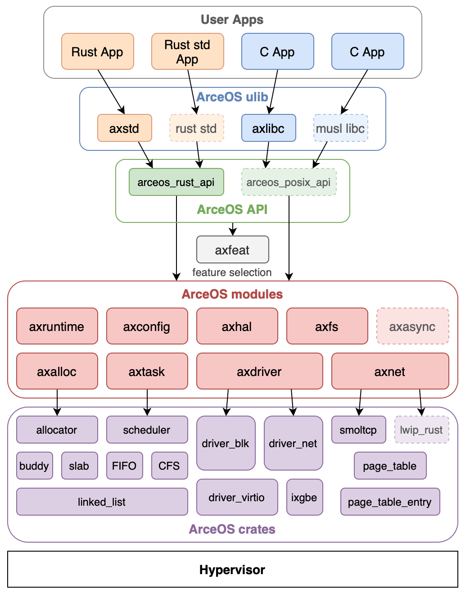
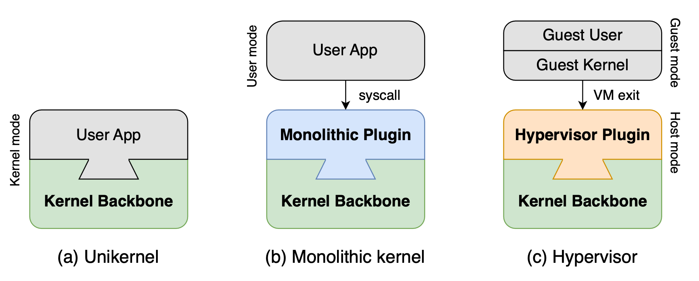

# 内核结构设计

## 基座内核设计

基座内核 ArceOS 以组件化内核的思想进行设计，设计架构图如下：



每一个模块的简要介绍如下：

- crates layer: 内核无关组件，如 `page_table`, `slab_allocator`, `spinlock` 等，可以方便地给其他内核进行复用

- modules layer: 内核相关的组件。他们与内核的核心功能相关，不容易解耦出来给其他内核使用，但是对内核本身的功能以及重构有重要作用。
    - axalloc: 用于内核内存分配的模块
    - axfs: 文件系统管理模块, 接入了 fat32
    - axhal: 硬件抽象层模块
    - axnet: 网络管理模块，接入了 smoltcp 网络协议栈
    - axdriver: 驱动管理模块
    - axtask: 任务管理模块，包括任务单元的定义和调度功能的实现
    - axsync: 同步原语模块，包括一些 mutex 等同步原语等实现
    - axmm: 地址空间管理模块，包括内存映射等功能的实现

- axfeat: feature 描述层，用于进行 feature 的定制和转发，从而实现组件定制化的功能
    - feature 是 rust 条件编译的重要环节，详见[文档](https://doc.rust-lang.org/cargo/reference/features.html)

- api layer: ArceOS 对外提供的接口层
    - arceos_posix_api: POSIX 接口兼容实现层，在初始时是调用了 Unikernel 的接口，在 Starry 中会为其加入更多宏内核的支持
    - arceos_api: Unikernel 自身提供的接口层，用于其他应用程序调用内核的功能

- ulib layer: 用户库层，将 api layer 的接口进一步封装为更加兼容、常见的接口
    - axstd: rust std 的 Unikernel 实现，它调用的是 arceos 的功能，但是提供了更加常见的 std 接口
    - axlibc: libc 的 Unikernel 实现，它调用的是 arceos 的功能，但是提供了更加常见的 libc 接口

- user layer: 用户层，包括用户程序和用户程序的测试用例
    - rust app: rust 语言编写的用户程序，调用 axstd 从而调用 Unikernel 内核的功能
    - c app: c 语言编写的用户程序，与 axlibc 链接从而调用 Unikernel 内核的功能
    
## 异构内核设计实现

### 设计目标
ArceOS 希望实现灵活内核架构，即是通过使用一套框架搭建不同架构的内核，在内核架构和功能上都达到定制的目的，从而做到 **one architecture to build all**。它有如下特性：

- 用一套框架搭建各种架构的内核
    - Unikernel
    - Macrokernel
    - Microkernel
    - Hypervisor
    - New structures defined by the user

- 最大化组件重用
    - 减少重复编码
    - 保持功能一致性

- 最大化灵活性
    - 易于扩展到新的内核架构

### 设计思路

基本思路：
- Unikernel 是所有内核架构的交集
- 将可定制的 Unikernel 作为基本框架与执行环境（Kernel Backbone）
- 将各种架构的内核视为 Unikernel 上的 App（Kernel Plugin）

利用 Backbone 和 Plugin 的关系，我们可以实现不同架构的内核，对于宏内核和 hypervisor 的设计图如下：



通过运行不同的内核应用扩展，我们就可以定制不同架构的内核。starry-next 即是对宏内核扩展的实践。我们期望做到：在不需要完全了解底层内核具体技术实现的情况下，**通过提供的接口，即可完成宏内核功能的扩展**。

## starry-next 如何实现宏内核功能

starry-next 是对 ArceOS 的扩展。依据 Plugin 的设计，它作为 ArceOS 的一个应用（这里我们称为**内核应用**）开始运行。对应在 Makefile 下的执行逻辑是：

```Makefile
AX_ROOT ?= $(PWD)/.arceos
# Makefile under starry-next folders
build run justrun debug disasm: ax_root
	@make -C $(AX_ROOT) A=$(PWD) FEATURES=$(FEATURES) $@
```

这里可以看到它通过 `-C $(AX_ROOT)` 指定了调用 ArceOS 的 Makefile，并制定运行的内核应用为当前目录，即 starry-next。

查看 starry-next 的 Cargo.toml 文件如下：

```toml
[dependencies]
log = "0.4"
linkme = "0.3"
axerrno = "0.1"
memory_addr = "0.3"
xmas-elf = "0.9"
bitflags = "2.6"
kernel-elf-parser = "0.1.0"
num_enum = { version = "0.7", default-features = false }
syscalls = { version = "0.6", default-features = false }

axstd = { git = "https://github.com/arceos-org/arceos.git", branch = "monolithic", features = ["paging"] }
axhal = { git = "https://github.com/arceos-org/arceos.git", branch = "monolithic", features = ["uspace"] }
axmm = { git = "https://github.com/arceos-org/arceos.git", branch = "monolithic" }
axtask = { git = "https://github.com/arceos-org/arceos.git", branch = "monolithic" }
axsync = { git = "https://github.com/arceos-org/arceos.git", branch = "monolithic" }
axruntime = { git = "https://github.com/arceos-org/arceos.git", branch = "monolithic", features = ["multitask"] }
arceos_posix_api = { git = "https://github.com/arceos-org/arceos.git", branch = "monolithic" }

[target.'cfg(target_arch = "x86_64")'.dependencies]
x86 = "0.52"

[build-dependencies]
toml_edit = "0.22"
```

> 由于目前宏内核实现仍然未合入主线，因此我们手动指定了 `monolithic` 分支。

这里比较重要的是对于 `axhal` 启动了 `uspace` feature, `axhal` 模块中标注了 `uspace` feature 的实现可以看到，它包含如下内容：
- `UspaceContext` 实现，包含了用户态上下文的定义与进入用户态的初始化代码
- Syscall trap 接收与转发
- User trap and exit 实现
当添加了这些必要内容之后，我们就对 Unikernel 提供的 Task 结构添加了进入用户态的能力。在 `src/task.rs` 下我们调用 `spawn_user_task` 的时候，就可以创建一个即将进入用户态、运行用户应用的任务了。

```rust
pub fn spawn_user_task(aspace: Arc<Mutex<AddrSpace>>, uctx: UspaceContext) -> AxTaskRef {
    let mut task = TaskInner::new(
        || {
            let curr = axtask::current();
            let kstack_top = curr.kernel_stack_top().unwrap();
            // 设置任务上下文，让任务在开始被调度之后尝试进入用户态
            unsafe { curr.task_ext().uctx.enter_uspace(kstack_top) };
        },
        "userboot".into(),
        crate::config::KERNEL_STACK_SIZE,
    );
    task.ctx_mut()
        .set_page_table_root(aspace.lock().page_table_root());
    task.init_task_ext(TaskExt::new(uctx, aspace));
    axtask::spawn_task(task)
}
```

按照这个思路，我们可以做到在最小化添加 uspace feature 的情况下，实现宏内核的功能扩展。Unikernel 已有的任务调度、文件系统、网络栈等服务都可以直接被宏内核所复用。此后只需要根据 POSIX syscall 标准，在上层的内核应用中实现对应的系统调用，即可适配更多的应用。